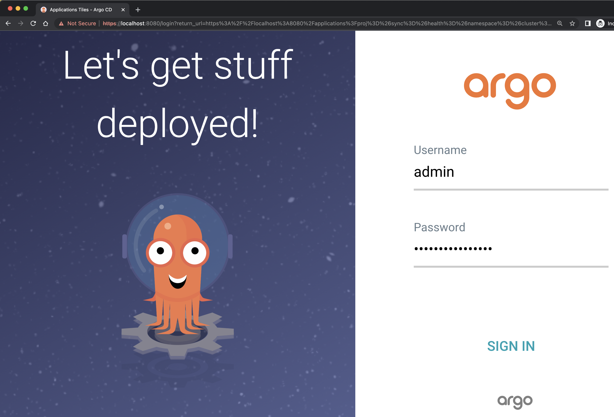
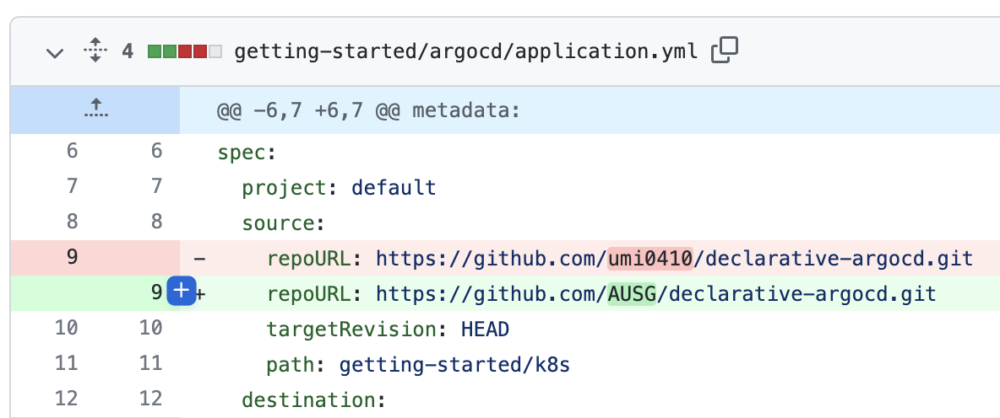
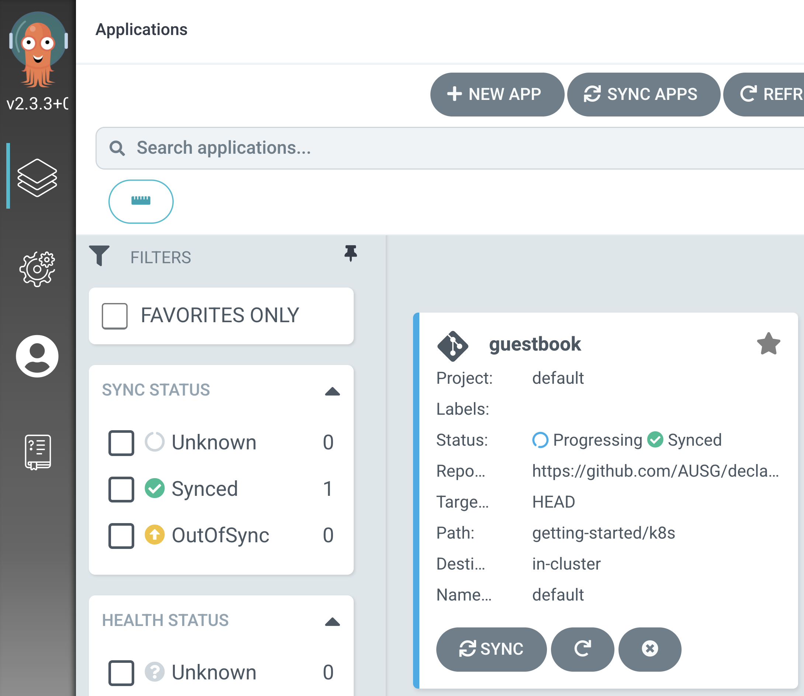
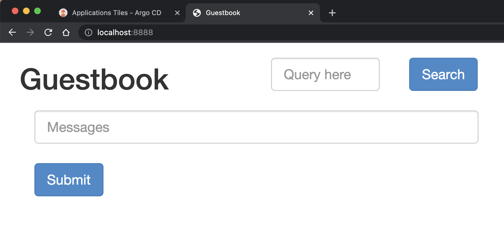
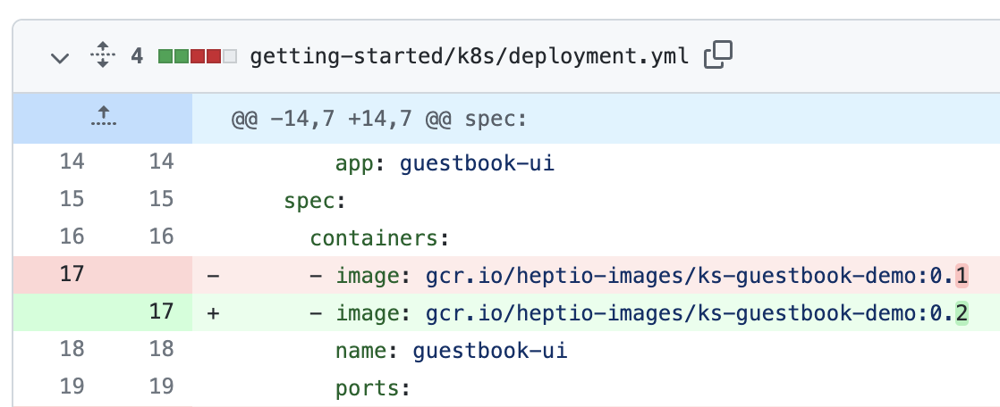
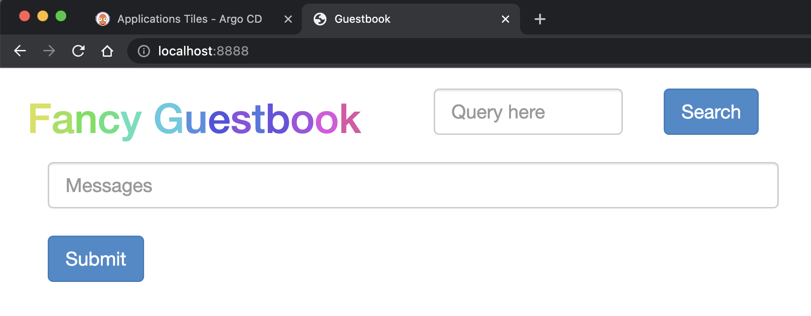
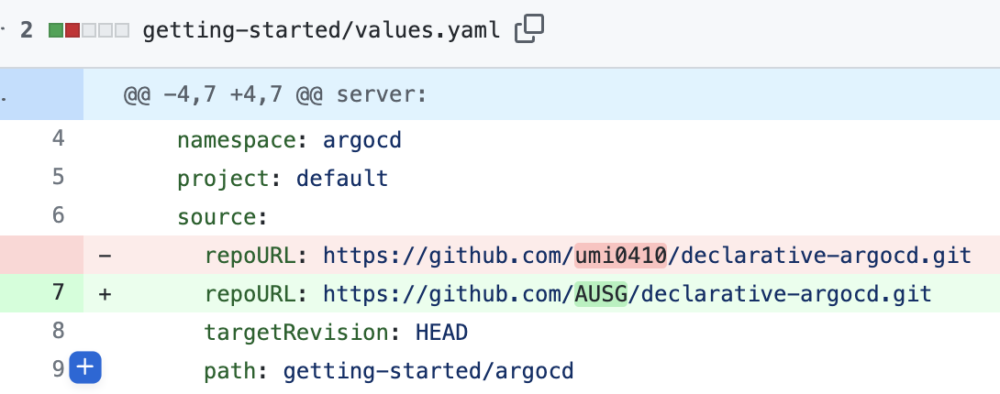
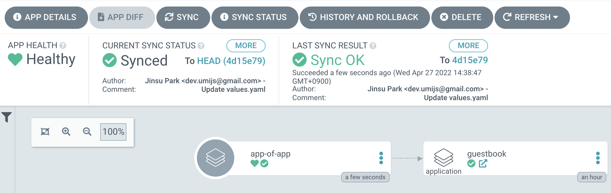

<!-- theme: uncover -->
<!-- class: invert -->


# `ArgoCD`를 통해 GitOps로
# 지속적 배포해보기

박진수

---
# 목차

* 🧑 자기소개
* 📔 용어사전
* 🎤 발표 주제 설명: ArgoCD로 GitOps 이용하기
* minikube + Helm으로 ArgoCD install하기
* Continuous Deployment 체험해보기
* 선언적으로 개선: App of App Pattern

---
# 🧑 자기소개


- 경희대학교 컴퓨터공학과
- (전) 메가존 클라우드 데브옵스 엔지니어 인턴
- (전) 당근마켓 플랫폼 서버 인턴
- 데브시스터즈 데브옵스 엔지니어
- 클라우드, 컨테이너, Go, Spring Boot, NoSQL, ...

---
# 📔 용어사전

* **minikube** - 로컬에서 간단히 쿠버 환경 구축
* **GitOps** - DevOps의 실현 형태 중 하나. 인프라나 애플리케이션 운영 정보에 대한 Single Source of Truth로서 Git Repository를 활용하는 형태
* **Helm**, **Chart** - K8s application을 패키징하여 편리하게 관리할 수 있도록 해주는 도구
* **CRD**(Custom Resource Definition) - K8s의 표준 Resource는 아니지만 개별적으로 정의하여 사용할 수 있는 리소스 kind들

---
# 📔 용어사전

* **ArgoCD** - GitOps를 위한 CD 서비스
* **Application** - ArgoCD가 사용하는 CRD 중 하나로 하나의 CD 작업 단위
* **AppProject** - Application이 속하는 그룹 

* **선언적**(Declarative) - 과정을 생략하고 Desired State만을 정의하는 것

---
# 🎤 발표 주제 설명

> DevOps, GitOps, CD, ArgoCD, Helm, Declarative, ...

* **`ArgoCD`를 통해 GitOps로 지속적 배포해보기!**
  1. helm chart로 ArgoCD 배포
  2. Fork 뜬 레포를 통해 CD
     a. guestbook을 배포하기 위한 ArgoCD Application
     b. guestbook에 대한 k8s manifest yaml files

  3. App of App 패턴을 통해 좀 더 선언적으로 개선

  α. 🤔 RBAC 설정을 통해 계정별 ArgoCD에 대한 권한 관리

---
# Requirements

* `minikube`
  * `brew install minikube && minikube start`
* `kubectl`
  * `brew install kubectl && kubectl version`
* `helm`
  * `brew install helm && helm version`
* `Github account`
  * 예시 레포(https://github.com/umi0410/declarative-argocd)를 포크뜬 뒤 자신의 레포를 통해 Continuouse Deploy하기 위함

---
# minikube

```console
$ minikube start
😄  minikube v1.25.2 on Darwin 12.2 (arm64)
✨  Automatically selected the docker driver
...
```

minikube로 로컬에 쿠버네티스 환경을 구축해요.

---
# helm

```console
$ helm repo add argo https://argoproj.github.io/argo-helm
"argo" has been added to your repositories

$ kubectl create ns argocd

$ helm install -n argocd argocd-demo argo/argo-cd
NAME: argocd-demo
...
1. kubectl port-forward service/argocd-demo-server -n argocd 8080:443

    and then open the browser on http://localhost:8080 and accept the certificate
...
You can find the password by running:

kubectl -n argocd get secret argocd-initial-admin-secret -o jsonpath="{.data.password}" | base64 -d
```
helm을 통해 ArgoCD를 쿠버네티스 클러스터에 설치해요.

---
# 접속하기

```console
$ kubectl get pod -n argocd
NAME                                                    READY   STATUS              RESTARTS   AGE
argocd-demo-application-controller-0                    0/1     ContainerCreating   0          19s
argocd-demo-applicationset-controller-ddc9ff685-vsrsl   0/1     ContainerCreating   0          19s
...

$ kubectl get pod -n argocd
NAME                                                    READY   STATUS    RESTARTS   AGE
argocd-demo-application-controller-0                    1/1     Running   0          73s
argocd-demo-applicationset-controller-ddc9ff685-vsrsl   1/1     Running   0          73s

$ kubectl -n argocd get secret argocd-initial-admin-secret -o jsonpath="{.data.password}" | base64 -d
WhvQaBevvU-kazAn%

$ kubectl port-forward service/argocd-demo-server -n argocd 8080:443
Forwarding from 127.0.0.1:8080 -> 8080
Forwarding from [::1]:8080 -> 8080
```

---
# 접속하기




🎉🎉🎉

* ID: admin
* PW: WhvQaBevvU-kazAn
  * 설치 환경 마다 다름!

---
# CD할 guestbook Application

저는 Github Username을 `AUSG`로 사용해보겠습니다.

1. https://github.com/umi0410/declarative-argocd 를 포크 뜬다.

---
# CD할 guestbook Application


2. fork 뜬 Repository의 **getting-started/argocd/application.yml** 파일에서 **spec.source.repoURL** 값을 자신의 fork 뜬 Repository URL로 올바르게 수정하기

---
# CD할 guestbook Application



kubectl apply -n argocd -f https://raw.githubusercontent.com/umi0410/declarative-argocd/master/getting-started/argocd/application.yml

<br>

3. Application을 쿠버네티스 환경에 배포

---
# guestbook:0.1에 접속해보기



```console
$ kubectl port-forward service/guestbook-ui -n default 8888:80
Forwarding from 127.0.0.1:8888 -> 80
Forwarding from [::1]:8888 -> 80
```
---
# guestbook:0.2로 업그레이드



이미지 태그를 0.1 -> 0.2 로 변경 후 푸시!

---
# guestbook:0.2로 업그레이드



🎉🎉🎉

---
# 🤔 개선할 점..?

---
# 🤔 개선할 점..?

* helm으로 ArgoCD 설치 후 따로 수동으로 Application을 배포해줘야해요.
* 그 이후에도 Application을 변경할 때마다 직접 kubectl로 변경 사항을 적용해야해요.
  * e.g. `kubectl apply -f`
* Application을 코드로 나타냈지만 누군가 임의의 방식으로 변경을 하더라도 추적이나 관측이 되기 힘들어요.
  * e.g. Live state != Git Repository code

---
# App of App 패턴!!!


* Application을 나타낸 코드도 GitOps의 형태로 CD!
* 직접 kubectl을 사용할 필요 없음!
* 우두머리 Application을 하나만 잘 선언해놓으면 됨!

---
# App of App 패턴



* ArgoCD Helm Chart의 기능을 통해 helm으로 관리될 Application을 선언해요.

---
# App of App 패턴


```console
$ helm upgrade -n argocd argocd-demo \
  argo/argo-cd -f getting-started/values.yaml
```

* ArgoCD Helm Chart의 기능을 통해 helm으로 관리될 Application을 선언해요.

---
# 얼마나 선언적이란 말인가!

```console
$ minikube delete && minikube start
🔥  Deleting "minikube" in docker ...
...
🏄  Done! kubectl is now configured to use "minikube" cluster and "default" namespace by default

$ helm install -n argocd argocd-demo \
argo/argo-cd -f getting-started/values.yaml

$ kubectl port-forward service/guestbook-ui -n default 8888:80
```

App of App 패턴을 통해 선언적으로 CD를 정의함으로써
클러스터를 다시 구축해도 동일하게 guestbook:0.2로 CD 가능!

---
# 💡 +α

- `additionalApplications` 같은 설정 외에 다른 설정도 선언적으로 해보고 싶다!
  - e.g. `RBAC`, `OAuth`
- CI랑 연동해보고 싶다!
  - Github Action이나 Jenkins
- 어떻게 Deployment에서 Pod(Container)의 이미지 태그를 변경하는 작업을 자동화할 수 있는가?
  - Helm 혹은 Kustomize 이용해보기~
- [Blog 관련 게시글](https://umi0410.github.io/blog/devops/declarative-argocd-helm-app-of-app)
- [관련 Github Repository](https://github.com/umi0410/declarative-argocd)

---
# 마치며

* 너무 겉핥기라 혹은 너무 슉슉 지나가서 아쉬우신가요?!
  * => 👋 클둥 네트워킹 데이에 만나요~
  * 다음 세미나도 열어주세요~
* 발표 끝나고 따로 핸즈온 하려는데 안되신다구요?!
  * dev.umijs@gmail.com
  * Github: @umi0410
* 발표 피드백을 주고 싶으시다구요?!
  * 쓴 소리도 환영입니다 😆